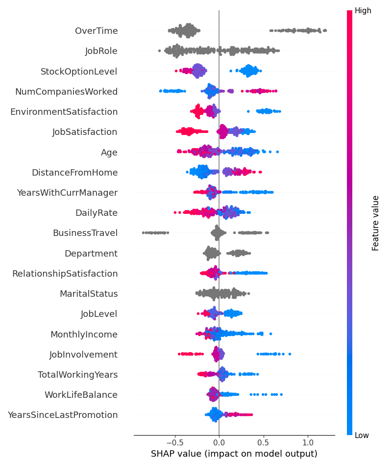
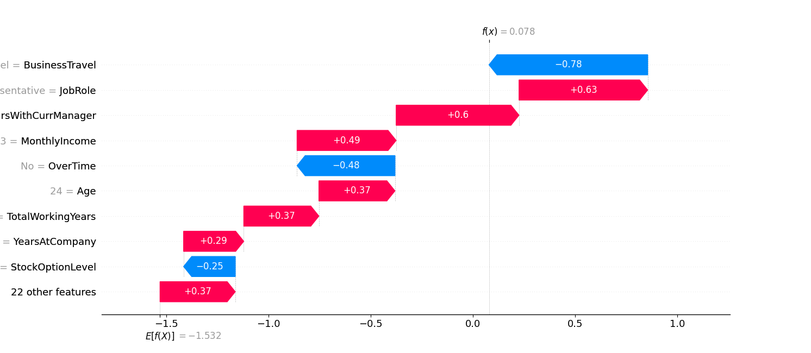

# CatBoost project using Optuna, SHAP, ROC-AUC and comparison with LR

HR Data analysis using CatBoost, Linear Regression, Optuna for finding better setting and SHAP to show beautiful plots.

## Project Overview

The project is being conducted with the aim of studying the CatBoost model, as well as libraries such as SHAP and Optuna:

* Models comparison
* Setting up model parameters
* Data visualization

The goal is to practice a complete analytical workflow to get HR insights.

## Technologies:

* Python
* Pandas
* Optuna
* SHAP
* CatBoost
* Scikit Learn

## Dataset  
The dataset is used in educational purposes.
https://www.kaggle.com/datasets/pavansubhasht/ibm-hr-analytics-attrition-dataset

## Project Components

### Preprocessing

* Imported the dataset.
* Performed some feature filtering.
* Bordered categorical and non-categorical features.

### Data Analysis

* Setting up the parameters of the model.
* Letting the model learn and build classification report, confusion matrix, print some metrics like accuracy and ROC-AUC for us to make a conclusion.
* Showing the models' feature importance.
* Adding Logistic Regression model for comparison.
* Building Optuna's objective function to find the best hyperparameters and its best score. 

### Data Visualization

* The SHAP was used to visualize the models conclusions. 
* The first plot is the overall feature importance according to SHAP, .summary_plot() method.
* The second plot is the feature impact in one specific row (in our case it is employee), .waterfall_plot() method.

## Skills Demonstrated

* Pathlib
* Model parameters setting
* Model pros and cons analysis
* Data Analysis
* Data Visualization (Available in screenshots folder)

## Author Erick
Focus areas:
* CatBoost
* SHAP
* Optuna
* Statistics
* Feature Importance
* Visualization